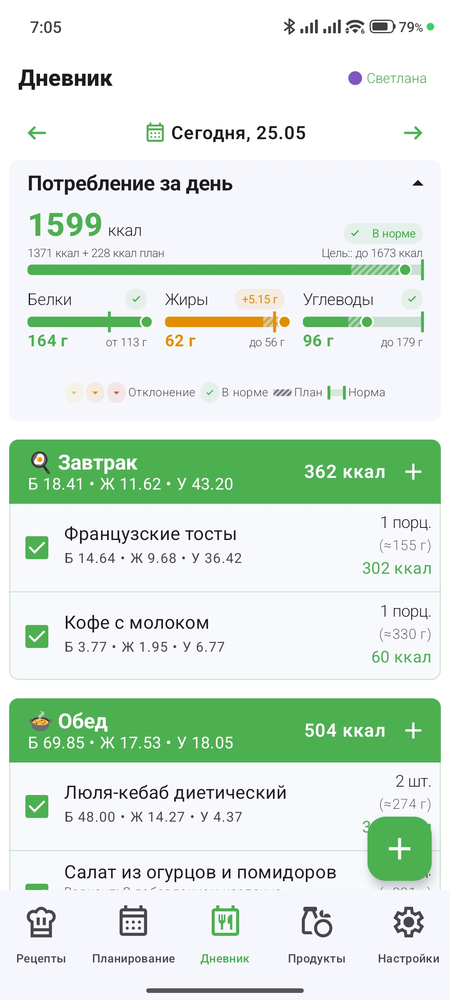
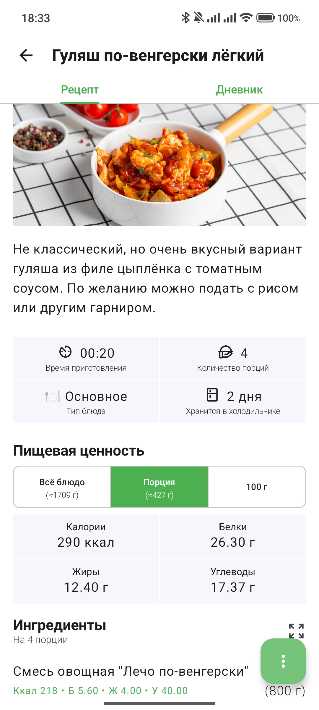
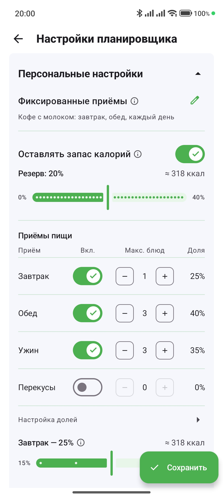
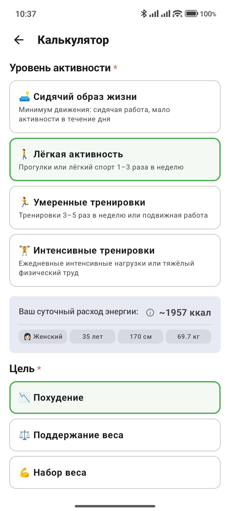
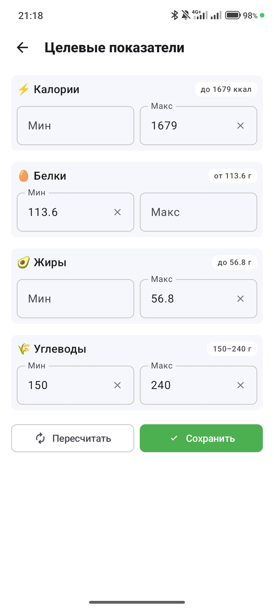
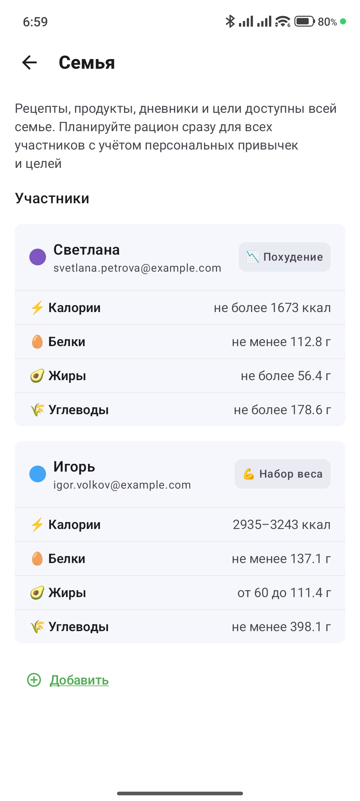

  

> SmartMeal is a multiplatform application for meal planning, nutrition tracking and family food management.
>
> The app combines recipes, nutrition goals, auto-planning, shopping workflows and everyday eating habits into a single connected system.
>
> SmartMeal focuses not only on calories, but also on real-life home cooking scenarios: meal prep for several days, leftovers, fixed meals and different nutrition goals within a family.

---

Kotlin Multiplatform project with shared UI, business logic, networking and local caching for Android and iOS.

SmartMeal is designed as a practical everyday tool focused on reducing manual routine around nutrition and meal organization.

The project is actively evolving, with both functionality and UI continuously improving as the product grows.

🌐 [Project Website](https://smartmeal-app.tilda.ws/)

---

## 👨🏻‍💻 Author

[**Svetlana Filippova**](https://github.com/SvitlanaFilippova)

Product idea, architecture, UI/UX, mobile development, meal-planning domain logic and backend development.

---

## ✨ Key Features

- Auto-generated meal plans based on real family eating habits
- Meal prep workflows and leftovers tracking
- Family sharing and multiple nutrition goals
- Flexible recipe variations and customization
- Fixed meals and recurring eating routines
- Flexible calorie and macronutrient goals
- Unified ecosystem for recipes, products, planning and nutrition tracking

---

## 📋 App Features

| Feature | Status |
|---|---|
| Nutrition diary with goal progress tracking | ✔️ Implemented |
| Automatic multi-day meal planning | ✔️ Implemented |
| Manual plan customization and pinned meal days | ✔️ Implemented |
| Adding recipes, products and planned meals to the diary | ✔️ Implemented |
| Flexible planner profile: meals, snacks and restrictions | ✔️ Implemented |
| Excluding unwanted recipes and products | ✔️ Implemented |
| Shared family library for recipes, products and diaries | ✔️ Implemented |
| Built-in and custom recipe catalog | ✔️ Implemented |
| Custom recipe creation with macros, steps and servings | ✔️ Implemented |
| Recipe import from plain text with preview | ✔️ Implemented |
| Recipe search and filtering | ✔️ Implemented |
| Product library with user-defined items | ✔️ Implemented |
| Flexible measurement units and gram conversion | ✔️ Implemented |
| Copying system recipes and products into personal collections | ✔️ Implemented |
| Separate tracking for planned and consumed meals | ✔️ Implemented |
| Daily calorie and macronutrient summary | ✔️ Implemented |
| Calorie and macronutrient goal calculation | ✔️ Implemented |
| Body profile and weight history | ✔️ Implemented |
| Email authentication and guest mode | ✔️ Implemented |
| Light, dark and system themes | ✔️ Implemented |
| Data synchronization via Supabase | ✔️ Implemented |
| Offline catalog access with Room | ✔️ Implemented |
| Automatic shopping list generation | ✔️ Implemented |
| External food API integration | 🔜 Planned |
| Barcode-based product scanning | 🔜 Planned |
| Advanced meal planner filters | 🔜 Planned |
| Goal achievement analytics and statistics | 🔜 Planned |
| Recipe import via URL | 🔜 Planned |
| AI-powered recipe adaptation | 🔜 Planned |

---

## 📚 Technologies & Tools

| Category | Technologies |
|---|---|
| Platforms | Kotlin Multiplatform (Android, iOS) |
| UI | Compose Multiplatform, Material 3, Compose Resources |
| Architecture | Clean Architecture, MVI, Decompose, Coroutines, StateFlow |
| Dependency Injection | Koin |
| Navigation | Decompose (tab stacks and nested navigation) |
| Networking & API | Ktor (OkHttp / Darwin), kotlinx.serialization |
| Backend | Supabase (PostgreSQL, PostgREST, Auth) |
| Local Storage | Room (KMP), DataStore, SQLite Bundled |
| Images | Kamel |
| Date & Time | kotlinx-datetime |
| Build & Configuration | Gradle Version Catalog, BuildKonfig |
| Code Quality | Detekt, Android Lint |
| Logging | Napier |
| UI Utilities | Reorderable (drag-and-drop lists) |

---

## 🏗️ Architecture

The project is built using **Clean Architecture** and **MVI** principles with clear layer separation:

- **Presentation** — Compose Multiplatform, Decompose components, UI models and mapping
- **Domain** — use cases, domain models, meal-planning logic, nutrition calculations and personalization
- **Data** — repositories, Ktor + Supabase, Room, DataStore and catalog synchronization

Functionality is organized into feature-based modules inside the `shared` module.  
Each feature (`recipes`, `ingredients`, `diary`, `mealplan`, `settings`, etc.) contains its own `data/`, `domain/` and `presentation/` layers.

Dependencies are managed with **Koin**.

Main application sections:

- **Recipes**
- **Products**
- **Diary**
- **Planning**
- **Settings**

---

## 📱 Application Interface

---

## 📦 Download

SmartMeal is currently under active development and available as a working prototype.

Android APKs and test builds are available in the Releases section:

https://github.com/SvitlanaFilippova/SmartMeal-public/releases
